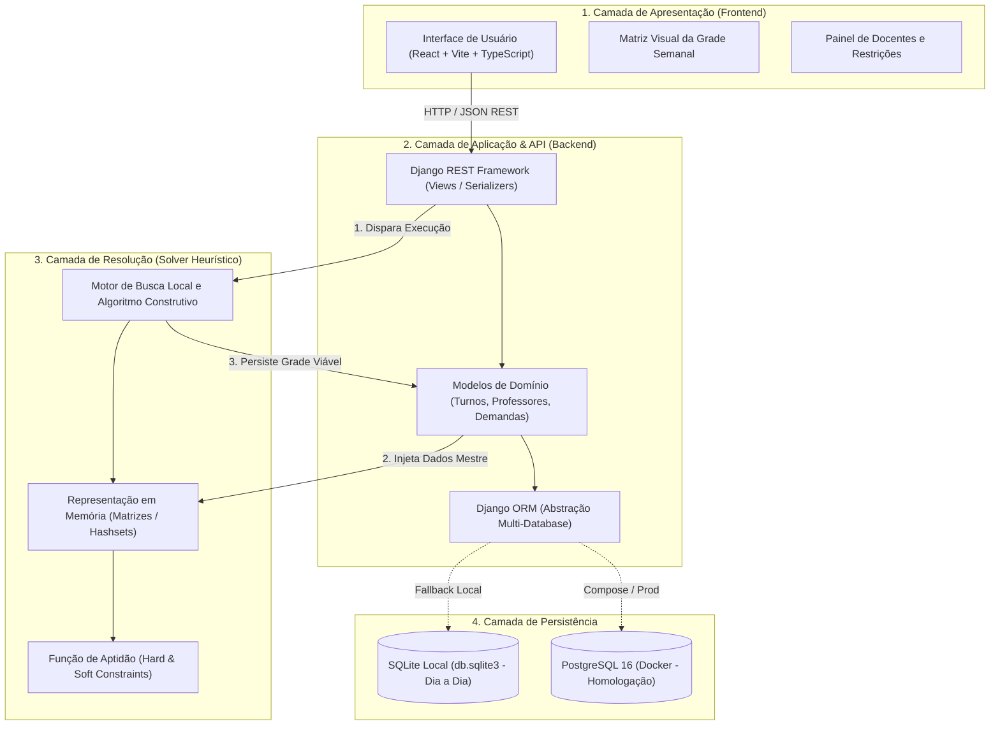

# 🏛️ Arquitetura de Software e Ambientes — EduSchedule Timetabling

> **Status:** Documento Oficial de Engenharia de Software  
> **Sistema:** Gerador e Gestor de Grades Horárias Escolares (UCTP — University/School Timetabling Problem)  
> **Padrão Arquitetural:** Monorepo com Arquitetura em 3 Camadas e Suporte a Ambientes Híbridos

---

## 1. Visão Geral do Sistema

O **EduSchedule Timetabling** é uma plataforma desenvolvida para resolver o problema de alocação de horários escolares e acadêmicos, categorizado na literatura de Ciência da Computação como um problema de otimização combinatória **NP-difícil**.

A arquitetura do software foi concebida para atender a dois pilares fundamentais:
1. **Robustez de Domínio e Engenharia:** Separação clara de responsabilidades entre entrada de dados pedagógicos (demandas curriculares) e resolução algorítmica (alocação de grade).
2. **Experiência de Desenvolvimento Sem Fricção:** Capacidade de alternar transparentemente entre um ambiente local ultra-rápido (para desenvolvimento diário ágil) e um ambiente conteinerizado corporativo (para homologação, testes com PostgreSQL e apresentação para banca avaliadora).

---

## 2. As Três Camadas da Aplicação



### Camada 1: Apresentação (Frontend SPA)
* **Tecnologias:** React 18, Vite, TypeScript, CSS Moderno.
* **Localização:** `frontend/`
* **Responsabilidade:** Renderização da matriz semanal de horários por turma e por professor, interface de parametrização de pesos de restrições (ex: tolerância a janelas vagas) e formulários de cadastro.
* **Comunicação:** Totalmente desacoplada do backend, consumindo a API REST através de endpoints padronizados em JSON (`http://127.0.0.1:8000/api/`).

### Camada 2: Aplicação e Negócio (Backend Django REST)
* **Tecnologias:** Python 3.12, Django 5.x, Django REST Framework, django-cors-headers.
* **Localização:** `backend/`
* **Responsabilidade:** 
  - Manutenção da integridade relacional entre cursos, turnos, professores, restrições e demandas curriculares.
  - Endpoints REST para operações de CRUD e disparador do solver.
  - Abstração de persistência através do Django ORM, garantindo paridade entre SQLite e PostgreSQL.

### Camada 3: Motor Algorítmico e Heurístico (Solver em Memória)
* **Tecnologias:** Python nativo de alta performance (sem overhead de banco em loops internos).
* **Localização:** `backend/solver/`
* **Responsabilidade:** 
  - Execução de meta-heurísticas (Algoritmo Construtivo Guloso com Busca Local) para resolução do Timetabling em tempo previsível (*time budget* de segundos).
  - Isolamento estrito de I/O: os dados são carregados do banco para estruturas de memória otimizadas (dicionários e matrizes); o algoritmo avalia milhares de trocas de slots por segundo na RAM; ao convergir para uma solução viável (zero choques), a grade gerada é salva de volta nas tabelas de alocação via ORM.

---

## 3. Arquitetura de Ambientes: Dia a Dia vs. Homologação

Para conciliar a velocidade de desenvolvimento da equipe com os requisitos formais acadêmicos da disciplina, o sistema opera sob uma **arquitetura de ambientes híbrida**:

| Dimensão de Comparação | Modo Dia a Dia (Desenvolvimento Ágil) | Modo Homologação / Apresentação (Docker) |
| :--- | :--- | :--- |
| **Banco de Dados** | **SQLite** (`backend/db.sqlite3`) | **PostgreSQL 16 Alpine** oficial |
| **Execução** | Nativa no Windows via Scripts em lote (`.bat`) | Orquestrada em containers via Docker Compose |
| **Ambiente Python** | `.venv` isolado na raiz do projeto | Imagem `python:3.12-slim-bookworm` |
| **Tempo de Inicialização** | **< 1 segundo** (Instantâneo) | ~10 a 20 segundos (subida de containers) |
| **Consumo de Memória RAM** | Mínimo (~50MB de RAM) | Moderado (~1.5GB a 2GB com Docker Desktop) |
| **Facilidade de Reset** | Apaga `db.sqlite3` e roda `setup_dev.bat` (5s) | `docker compose down -v` e sobe novamente |
| **Objetivo Principal** | Codificação rápida de telas, rotas e solver | Validação de banco corporativo, testes de banca e deploy |

---

## 4. Mecanismo de Chaveamento Declarativo e Transparente

O chaveamento entre SQLite e PostgreSQL é realizado de forma automática e declarativa no arquivo [backend/eduschedule_backend/settings.py](file:///c:/Users/Kauê/Documents/TimeTabling/backend/eduschedule_backend/settings.py):

```python
# Trecho conceitual de settings.py:
DB_ENGINE = os.getenv('DB_ENGINE', 'sqlite').lower()

if DB_ENGINE in ('postgres', 'postgresql'):
    DATABASES = {
        'default': {
            'ENGINE': 'django.db.backends.postgresql',
            'NAME': os.getenv('DB_NAME', 'timetabling'),
            'USER': os.getenv('DB_USER', 'postgres'),
            'PASSWORD': os.getenv('DB_PASSWORD', 'postgres'),
            'HOST': os.getenv('DB_HOST', 'localhost'),
            'PORT': os.getenv('DB_PORT', '5432'),
        }
    }
else:
    DATABASES = {
        'default': {
            'ENGINE': 'django.db.backends.sqlite3',
            'NAME': BASE_DIR / 'db.sqlite3',
        }
    }
```

- **Como funciona no dia a dia:** Ao executar `run_backend.bat`, nenhuma variável externa força o PostgreSQL. O sistema utiliza SQLite local por padrão com máxima performance.
- **Como funciona no Docker:** O arquivo [docker-compose.yml](file:///c:/Users/Kauê/Documents/TimeTabling/docker-compose.yml) injeta as variáveis `DB_ENGINE=postgresql` e `DB_HOST=db`. Ao inicializar, o Django conecta automaticamente no container do PostgreSQL sem exigir alteração em uma única linha de código.

---

## 5. Estratégia de Massa de Dados e Reprodutibilidade

Para garantir que novos desenvolvedores ou examinadores consigam interagir com o sistema imediatamente sem passar pelo atrito de cadastros manuais extensos:
- **No SQLite (Local):** O comando `python manage.py seed_data` ([seed_data.py](file:///c:/Users/Kauê/Documents/TimeTabling/backend/core/management/commands/seed_data.py)) popula o banco de forma idempotente em segundos com dados completos de teste (12 disciplinas, 11 professores, 275 slots de disponibilidade, turmas e pesos).
- **No PostgreSQL (Docker):** O container do banco executa os scripts canônicos [schema-postgresql.sql](file:///c:/Users/Kauê/Documents/TimeTabling/docs/schema-postgresql.sql) e [sample-dataDB.sql](file:///c:/Users/Kauê/Documents/TimeTabling/docs/sample-dataDB.sql) via ponto de montagem oficial `/docker-entrypoint-initdb.d/`.

---

## 6. Documentos Correlatos e Rastreabilidade

- [SETUP_EQUIPE.md](file:///c:/Users/Kauê/Documents/TimeTabling/SETUP_EQUIPE.md) — Guia prático de instalação, onboarding e comandos operacionais.
- [decisoes-arquiteturais.md](file:///c:/Users/Kauê/Documents/TimeTabling/docs/decisoes-arquiteturais.md) — Registro histórico formal de decisões técnicas (ADRs 001 a 008).
- [schema-postgresql.sql](file:///c:/Users/Kauê/Documents/TimeTabling/docs/schema-postgresql.sql) — Definição DDL formal das tabelas e constraints de integridade no PostgreSQL.
