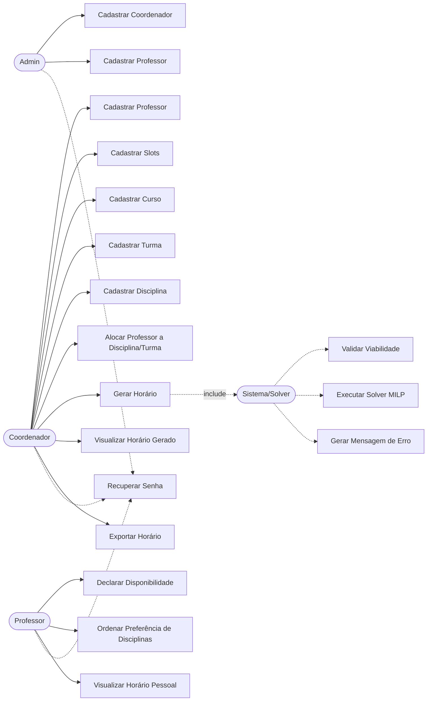

# Casos de Uso — Sistema de Timetabling

## Atores

- **Admin** — único no sistema, cadastra coordenadores e professores
- **Coordenador** — cadastra os dados operacionais e dispara a geração do horário
- **Professor** — declara disponibilidade e consulta seu horário
- **Sistema (Solver)** — ator secundário, executa a geração automática (incluído em UC10)

---

## Diagrama (visão geral, aproximação em fluxograma)

---

## Detalhamento dos casos de uso principais

### UC1 — Cadastrar Coordenador
- **Ator:** Admin
- **Pré-condição:** Admin autenticado
- **Fluxo:** Admin informa dados do coordenador (nome, login, senha) → sistema cria conta → coordenador pode fazer login
- **Pós-condição:** Novo coordenador ativo no sistema

### UC2/UC3 — Cadastrar Professor
- **Ator:** Admin ou Coordenador
- **Fluxo:** Informa nome, login, senha inicial → sistema cria conta de professor
- **Pós-condição:** Professor pode fazer login e declarar disponibilidade

### UC4 — Cadastrar Slots de Horário
- **Ator:** Coordenador
- **Fluxo:** Coordenador define dia da semana, horário de início e duração de cada slot
- **Regra de negócio:** Slots não podem se sobrepor
- **Pós-condição:** Slots disponíveis para professores declararem disponibilidade e para o solver alocar

### UC5/UC6/UC7 — Cadastrar Curso / Turma / Disciplina
- **Ator:** Coordenador
- **Fluxo:** Cadastro simples de cada entidade (ver atributos no DER)

### UC8 — Alocar Professor a Disciplina/Turma
- **Ator:** Coordenador
- **Pré-condição:** Professor já declarou disponibilidade
- **Fluxo:** Coordenador seleciona turma + disciplina + professor, define quantidade de aulas/semana. Sistema cria N linhas na entidade `Aula` (uma por aula da semana), todas com `slot` nulo até o solver rodar
- **Regra de negócio:** Sistema valida que a soma das aulas já alocadas ao professor não excede sua disponibilidade declarada — se exceder, bloqueia e avisa
- **Pós-condição:** Aulas registradas (com `slot` nulo), prontas para entrar no solver

### UC9 — Gerar Horário
- **Ator:** Coordenador
- **Pré-condição:** Todas as aulas e disponibilidades cadastradas
- **Fluxo:**
  1. Coordenador solicita geração
  2. Sistema valida viabilidade prévia (**inclui UC16**)
  3. Se inviável → gera mensagem de erro compreensível (**inclui UC18**) e encerra
  4. Se viável → executa o solver MILP (**inclui UC17**)
  5. Sistema preenche o `slot` de cada `Aula` pendente com o resultado
- **Pós-condição:** Horário gerado (aulas com `slot` preenchido) e disponível para visualização/exportação, ou erro claro reportado

### UC10 — Visualizar Horário Gerado
- **Ator:** Coordenador
- **Fluxo:** Sistema exibe o horário agrupado por curso/turma com horários compatíveis (ex: Ensino Médio manhã+tarde juntos)

### UC11 — Exportar Horário
- **Ator:** Coordenador
- **Fluxo:** Sistema gera arquivo (Excel/tabela) com o horário, organizado por dia+horário+professor e dia+disciplina+turma

### UC12 — Declarar Disponibilidade
- **Ator:** Professor
- **Pré-condição:** Coordenador já cadastrou os slots
- **Fluxo:** Professor marca quais slots estão disponíveis para lecionar

### UC13 — Ordenar Preferência de Disciplinas (opcional/"plus")
- **Ator:** Professor
- **Fluxo:** Professor ordena, por prioridade simples, as disciplinas que leciona
- **Observação:** Fora do escopo obrigatório — só implementar se sobrar tempo

### UC14 — Visualizar Horário Pessoal
- **Ator:** Professor
- **Pré-condição:** Horário já foi gerado pelo coordenador
- **Fluxo:** Professor consulta seus próprios slots alocados

### UC15 — Recuperar Senha
- **Ator:** Admin, Coordenador ou Professor
- **Fluxo:** Usuário solicita recuperação → sistema envia mecanismo de redefinição (ex: e-mail com link/token)

---

## Casos de uso do Sistema/Solver (incluídos em UC9)

### UC16 — Validar Viabilidade
- Verifica, antes de rodar o solver pesado, se existem inconsistências óbvias (ex: dia da semana sem nenhum professor disponível, disciplina sem cobertura possível de horário)

### UC17 — Executar Solver MILP
- Roda o algoritmo de otimização (PuLP/OR-Tools) sobre as aulas pendentes e disponibilidades, respeitando restrições fortes e minimizando violação de restrições fracas

### UC18 — Gerar Mensagem de Erro
- Traduz a causa técnica da inviabilidade em mensagem compreensível para usuário não-técnico (ex: "Não foi possível gerar o horário: [disciplina X] não tem professor disponível em [dia Y]")
