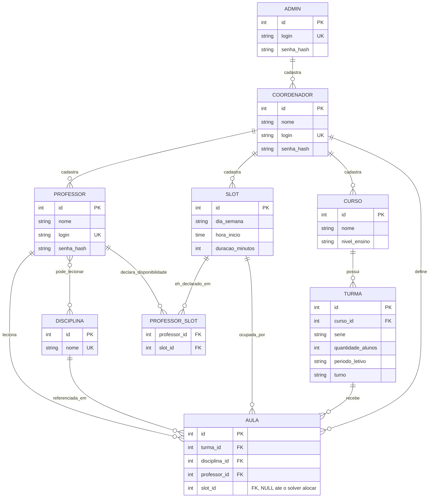

# Diagrama Entidade-Relacionamento (DER) — Timetabling

```mermaid
erDiagram
    ADMIN ||--o{ COORDENADOR : cadastra
    COORDENADOR ||--o{ PROFESSOR : cadastra
    COORDENADOR ||--o{ SLOT : cadastra
    COORDENADOR ||--o{ CURSO : cadastra
    COORDENADOR ||--o{ AULA : define

    CURSO ||--o{ TURMA : possui
    TURMA ||--o{ AULA : recebe
    DISCIPLINA ||--o{ AULA : referenciada_em
    PROFESSOR ||--o{ AULA : leciona
    PROFESSOR }o--o{ DISCIPLINA : pode_lecionar
    PROFESSOR ||--o{ PROFESSOR_SLOT : declara_disponibilidade
    SLOT ||--o{ PROFESSOR_SLOT : eh_declarado_em
    SLOT ||--o{ AULA : ocupada_por

    ADMIN {
        int id PK
        string login UK
        string senha_hash
    }
    COORDENADOR {
        int id PK
        string nome
        string login UK
        string senha_hash
    }
    PROFESSOR {
        int id PK
        string nome
        string login UK
        string senha_hash
    }
    CURSO {
        int id PK
        string nome
        string nivel_ensino
    }
    TURMA {
        int id PK
        int curso_id FK
        string serie
        int quantidade_alunos
        string periodo_letivo
        string turno
    }
    DISCIPLINA {
        int id PK
        string nome UK
    }
    SLOT {
        int id PK
        string dia_semana
        time hora_inicio
        int duracao_minutos
    }
    PROFESSOR_SLOT {
        int professor_id FK
        int slot_id FK
    }
    AULA {
        int id PK
        int turma_id FK
        int disciplina_id FK
        int professor_id FK
        int slot_id "FK, NULL ate o solver alocar"
    }
```
