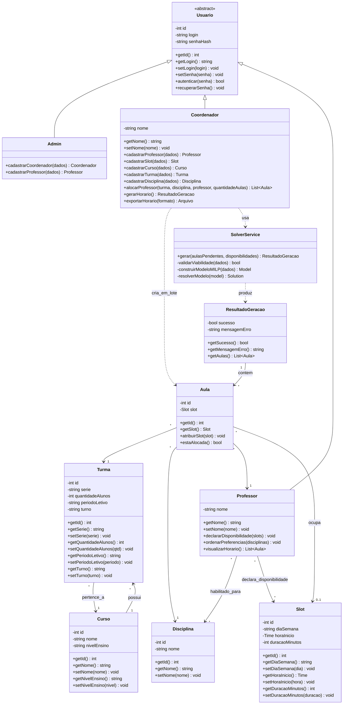

# Diagrama de Classes — Timetabling

```mermaid
classDiagram
    class Usuario {
        <<abstract>>
        -int id
        -string login
        -string senhaHash
        +getId() int
        +getLogin() string
        +setLogin(login) void
        +setSenha(senha) void
        +autenticar(senha) bool
        +recuperarSenha() void
    }

    class Admin {
        +cadastrarCoordenador(dados) Coordenador
        +cadastrarProfessor(dados) Professor
    }

    class Coordenador {
        -string nome
        +getNome() string
        +setNome(nome) void
        +cadastrarProfessor(dados) Professor
        +cadastrarSlot(dados) Slot
        +cadastrarCurso(dados) Curso
        +cadastrarTurma(dados) Turma
        +cadastrarDisciplina(dados) Disciplina
        +alocarProfessor(turma, disciplina, professor, quantidadeAulas) List~Aula~
        +gerarHorario() ResultadoGeracao
        +exportarHorario(formato) Arquivo
    }

    class Professor {
        -string nome
        +getNome() string
        +setNome(nome) void
        +declararDisponibilidade(slots) void
        +ordenarPreferencias(disciplinas) void
        +visualizarHorario() List~Aula~
    }

    class Curso {
        -int id
        -string nome
        -string nivelEnsino
        +getId() int
        +getNome() string
        +setNome(nome) void
        +getNivelEnsino() string
        +setNivelEnsino(nivel) void
    }

    class Turma {
        -int id
        -string serie
        -int quantidadeAlunos
        -string periodoLetivo
        -string turno
        +getId() int
        +getSerie() string
        +setSerie(serie) void
        +getQuantidadeAlunos() int
        +setQuantidadeAlunos(qtd) void
        +getPeriodoLetivo() string
        +setPeriodoLetivo(periodo) void
        +getTurno() string
        +setTurno(turno) void
    }

    class Disciplina {
        -int id
        -string nome
        +getId() int
        +getNome() string
        +setNome(nome) void
    }

    class Slot {
        -int id
        -string diaSemana
        -Time horaInicio
        -int duracaoMinutos
        +getId() int
        +getDiaSemana() string
        +setDiaSemana(dia) void
        +getHoraInicio() Time
        +setHoraInicio(hora) void
        +getDuracaoMinutos() int
        +setDuracaoMinutos(duracao) void
    }

    class Aula {
        -int id
        -Slot slot
        +getId() int
        +getSlot() Slot
        +atribuirSlot(slot) void
        +estaAlocada() bool
    }

    class SolverService {
        +gerar(aulasPendentes, disponibilidades) ResultadoGeracao
        -validarViabilidade(dados) bool
        -construirModeloMILP(dados) Model
        -resolverModelo(model) Solution
    }

    class ResultadoGeracao {
        -bool sucesso
        -string mensagemErro
        +getSucesso() bool
        +getMensagemErro() string
        +getAulas() List~Aula~
    }

    Usuario <|-- Admin
    Usuario <|-- Coordenador
    Usuario <|-- Professor

    Curso "1" --> "*" Turma : possui
    Turma "*" --> "1" Curso : pertence_a

    Coordenador ..> Aula : cria_em_lote
    Coordenador ..> SolverService : usa

    Professor "*" --> "*" Disciplina : habilitado_para
    Professor "*" --> "*" Slot : declara_disponibilidade

    Aula "*" --> "1" Turma
    Aula "*" --> "1" Disciplina
    Aula "*" --> "1" Professor
    Aula "*" --> "0..1" Slot : ocupa

    SolverService ..> ResultadoGeracao : produz
    ResultadoGeracao "1" --> "*" Aula : contem
```
